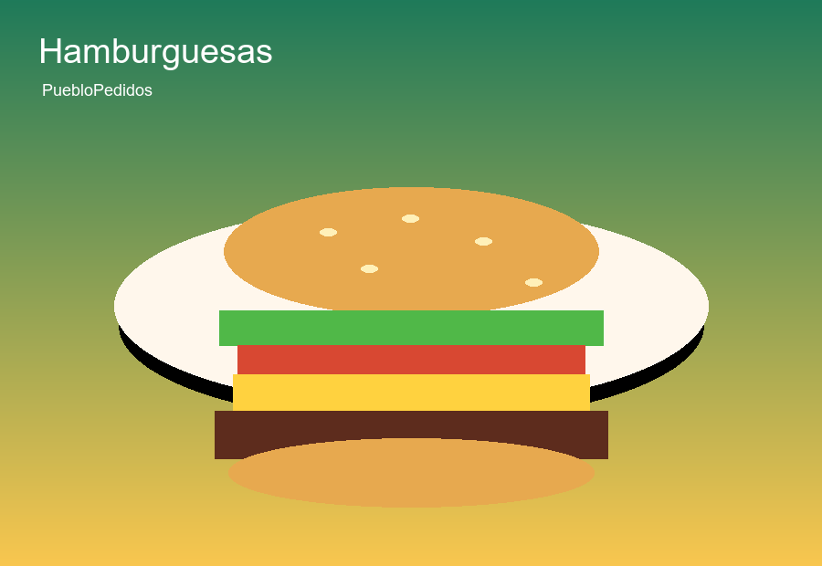

<!doctype html>
<html lang="es">
  <head>
    <meta charset="utf-8" />
    <meta name="viewport" content="width=device-width, initial-scale=1" />
    <title>PuebloPedidos - Marketplace local por WhatsApp</title>
    <meta
      name="description"
      content="Marketplace local de comida con perfil de cliente, perfil de tienda, productos, descuentos, destacados y pedidos por WhatsApp."
    />
    <link rel="stylesheet" href="./styles.css" />
  </head>
  <body>
    <header class="topbar">
      <a class="brand" href="#inicio" aria-label="PuebloPedidos inicio">
        P
        
          <strong>PuebloPedidos</strong>
          <small id="sessionLabel">Sin sesion</small>
        
      </a>
      

        <nav class="role-nav" id="roleNav" aria-label="Registro y perfiles">
          <button class="role-button" data-role-switch="client" type="button">Cliente</button>
          <button class="role-button" data-role-switch="store" type="button">Tienda</button>
        </nav>
        <button id="openOwnerPanelBtn" class="ghost-button compact owner-button" type="button">Admin</button>
        <button id="openCartBtn" class="cart-button" type="button">Carrito 0</button>
        <button id="openProfileBtn" class="ghost-button compact" type="button" hidden>Perfil</button>
        <button id="logoutBtn" class="ghost-button compact" type="button" hidden>Cerrar sesion</button>
      

    </header>

    <main id="inicio">
      <section id="authView" class="modal auth-modal" hidden aria-label="Registro">
        

          

            

              Cliente
              <h2 id="authTitle">Iniciar sesion</h2>
            

            <button id="closeAuthModal" class="icon-button" type="button" aria-label="Cerrar">x</button>
          

          
Entra con correo o WhatsApp y contrasena. El WhatsApp queda solo como contacto para pedidos.

          
Inicia sesion con correo o WhatsApp y contraseña. El WhatsApp se usa para contacto y pedidos, no como contraseña.

          

          <section class="auth-card" data-auth-card="client">
            
Cliente

            <h2>Entrar como cliente</h2>
            
Usa tu WhatsApp para recuperar direccion, pedidos y enviar compras mas rapido.

            <form id="clientLoginForm" class="stacked-form auth-login-form">
              <label>
                Correo o WhatsApp
                <input id="clientLoginPhone" required placeholder="Ej. 5551234567" />
              </label>
              <label>
                Contraseña
                <input id="clientLoginPassword" required type="password" minlength="8" placeholder="Minimo 8 caracteres" />
              </label>
              <button class="primary-button" type="submit">Iniciar sesion</button>
            </form>
            

              <button class="link-button" data-forgot-password="client" type="button">Olvidaste tu contrasena?</button>
              <button class="link-button" data-show-register="client" type="button">Registrarse ahora</button>
            

            <form id="clientForm" class="stacked-form register-form" hidden>
              
Crear cuenta nueva

              <label>
                Nombre
                <input id="clientName" required placeholder="Ej. Erika Rosales" />
              </label>
              <label>
                Correo
                <input id="clientEmail" required type="email" placeholder="erika@email.com" />
              </label>
              <label>
                WhatsApp
                <input id="clientPhone" required placeholder="Ej. 5551234567" />
              </label>
              <label>
                Contraseña
                <input id="clientPassword" required type="password" minlength="8" placeholder="Minimo 8 caracteres" />
              </label>
              <label>
                Direccion de entrega
                <textarea id="clientAddress" required rows="3" placeholder="Calle, numero, colonia y referencias"></textarea>
              </label>
              <label>
                Referencia rapida
                <input id="clientReference" placeholder="Ej. Casa azul frente a la primaria" />
              </label>
              <button class="ghost-button" type="submit">Crear cliente</button>
              <button class="link-button" data-show-login="client" type="button">Ya tengo cuenta</button>
            </form>
          </section>

          <section class="auth-card store-card" data-auth-card="store">
            
Tienda

            <h2>Entrar como tienda</h2>
            
El responsable entra con el WhatsApp del local para administrar productos y reportes.

            <form id="storeLoginForm" class="stacked-form auth-login-form">
              <label>
                Correo o WhatsApp del local
                <input id="storeLoginPhone" required placeholder="Ej. tienda@email.com" />
              </label>
              <label>
                Contraseña
                <input id="storeLoginPassword" required type="password" minlength="8" placeholder="Minimo 8 caracteres" />
              </label>
              <button class="primary-button" type="submit">Iniciar sesion</button>
            </form>
            

              <button class="link-button" data-forgot-password="store" type="button">Olvidaste tu contrasena?</button>
              <button class="link-button" data-show-register="store" type="button">Registrarse ahora</button>
            

            <form id="storeForm" class="stacked-form register-form" hidden>
              
Registrar negocio nuevo

              <label>
                Nombre del local
                <input id="storeName" required placeholder="Ej. Burger Plaza" />
              </label>
              <label>
                Responsable
                <input id="storeOwner" required placeholder="Nombre del dueno" />
              </label>
              <label>
                Correo del responsable
                <input id="storeEmail" required type="email" placeholder="dueno@email.com" />
              </label>
              <label>
                WhatsApp del local
                <input id="storePhone" required placeholder="Ej. 5559876543" />
              </label>
              <label>
                Contraseña
                <input id="storePassword" required type="password" minlength="8" placeholder="Minimo 8 caracteres" />
              </label>
              

              <label>
                Categoria
                <select id="storeCategory">
                  <option>Hamburguesas</option>
                  <option>Tacos</option>
                  <option>Pizza</option>
                  <option>Postres</option>
                  <option>Pollos</option>
                  <option>Sushi</option>
                </select>
              </label>
              <label>
                Creditos iniciales
                <input id="storeCredits" type="number" min="0" value="30" />
              </label>
              <label>
                Servicio
                <select id="storeServiceModes">
                  <option value="both">Entrega y recoger</option>
                  <option value="delivery">Solo entrega</option>
                  <option value="pickup">Solo recoger</option>
                </select>
              </label>
              

              <label>
                Direccion del local
                <textarea id="storeAddress" required rows="3" placeholder="Direccion visible para recoger pedidos"></textarea>
              </label>
              <button class="ghost-button" type="submit">Registrar tienda</button>
              <button class="link-button" data-show-login="store" type="button">Ya tengo cuenta</button>
            </form>
          </section>
          

        

      </section>

      <section id="clientView" class="view" aria-label="Pantalla cliente">
        

          <section class="market-area">
            

              

                Entregar en
                <strong id="clientAddressLabel">Direccion guardada</strong>
                <small id="clientReferenceLabel">Referencia</small>
              

              

                <button class="ghost-button compact" id="editClientProfileBtn" type="button">Editar perfil</button>
                <button class="ghost-button compact" id="openOrdersBtn" type="button">Mis pedidos 0</button>
              

            

            

              

                Centro del pueblo
                <h1>Pide comida en pocos toques.</h1>
                
Elige producto, confirma sugeridos y manda el pedido con tu direccion por WhatsApp.

              

              

                <button class="mode-button active" data-order-mode="Entrega" type="button">Entrega</button>
                <button class="mode-button" data-order-mode="Recoger" type="button">Recoger</button>
              

            

            

              

                1
                <strong>Explora</strong>
                <small>Tiendas, categorias y promos.</small>
              

              

                2
                <strong>Agrega</strong>
                <small>Notas por producto y carrito por tienda.</small>
              

              

                3
                <strong>Envia</strong>
                <small>Un WhatsApp separado a cada local.</small>
              

            

            

              

                Espacios pagados
                <h2>Promocionados cerca de ti</h2>
              

              Los locales pueden comprar 3 o 7 dias
            

            

            

              

                Locales asociados
                <h2>Tiendas del pueblo</h2>
              

              Abiertos y listos para WhatsApp
            

            

            

            <section id="storeProfileSection" class="store-profile-public" hidden>
              

              

                

                  Menu de tienda
                  <h2>Productos disponibles</h2>
                

                <button id="backToStoresBtn" class="ghost-button compact" type="button">Ver otras tiendas</button>
              

              

            </section>

            

              <input id="searchInput" class="search" type="search" placeholder="Buscar hamburguesa, tacos, postres..." />
            

            

            

          </section>

        

      </section>

      <section id="storeView" class="view" aria-label="Pantalla tienda">
        

          

            

              Panel de tienda
              <h1 id="storeTitle">Mi tienda</h1>
              
Sube productos, revisa contactos, ventas y creditos disponibles.

            

            

              <button id="exportStoreCsv" class="primary-button" type="button">Descargar reporte</button>
              <button id="addCreditsBtn" class="ghost-button" type="button">Comprar creditos</button>
            

          

          

          <section class="panel-card store-command-panel">
            

              

                Operacion rapida
                <h2>Link, creditos y acciones</h2>
              

              
            

            

          </section>

          <section class="panel-card campaign-panel">
            

              

                Publicidad
                <h2>Espacios promocionados</h2>
              

              3 dias $89 | 7 dias $169
            

            

          </section>

          <section class="panel-card">
            

              

                Mi tienda
                <h2>Datos del negocio</h2>
              

            

            <form id="storeProfileForm" class="store-profile-form">
              <label>
                Nombre del local
                <input id="profileStoreName" />
              </label>
              <label>
                Categoria
                <select id="profileStoreCategory">
                  <option>Hamburguesas</option>
                  <option>Tacos</option>
                  <option>Pizza</option>
                  <option>Postres</option>
                  <option>Pollos</option>
                  <option>Sushi</option>
                </select>
              </label>
              <label>
                WhatsApp del local
                <input id="profileStorePhone" />
              </label>
              <label>
                Servicio
                <select id="profileStoreServiceModes">
                  <option value="both">Entrega y recoger</option>
                  <option value="delivery">Solo entrega</option>
                  <option value="pickup">Solo recoger</option>
                </select>
              </label>
              <label class="wide-field">
                Direccion del local
                <textarea id="profileStoreAddress" rows="2"></textarea>
              </label>
              <button class="primary-button compact" type="submit">Guardar tienda</button>
            </form>
          </section>

          

            <section class="panel-card">
              Producto nuevo
              <h2>Alta de producto</h2>
              <form id="productForm" class="stacked-form">
                <label>
                  Imagen o fotografia
                  <input id="productImage" type="file" accept="image/*" capture="environment" />
                </label>
                
Sin imagen seleccionada

                <label>
                  Titulo
                  <input id="productTitle" required placeholder="Ej. Hamburguesa doble" />
                </label>
                <label>
                  Breve descripcion
                  <textarea id="productDescription" required rows="3" placeholder="Ingredientes principales y tamano"></textarea>
                </label>
                

                  <label>
                    Precio
                    <input id="productPrice" required type="number" min="1" step="1" placeholder="99" />
                  </label>
                  <label>
                    Disponible para
                    <select id="productAvailability">
                      <option value="both">Entrega y recoger</option>
                      <option value="delivery">Solo entrega</option>
                      <option value="pickup">Solo recoger</option>
                    </select>
                  </label>
                  <label>
                    Descuento
                    <select id="discountType">
                      <option value="none">Sin descuento</option>
                      <option value="percent">Porcentaje</option>
                      <option value="amount">Pesos</option>
                    </select>
                  </label>
                

                <label id="discountValueWrap" hidden>
                  Cantidad de descuento
                  <input id="discountValue" type="number" min="0" step="1" placeholder="Ej. 15 o 20" />
                </label>
                <label>
                  Destacar producto
                  <select id="featuredPlan">
                    <option value="none">No destacar</option>
                    <option value="3">3 dias destacados - $89</option>
                    <option value="7">7 dias destacados - $169</option>
                  </select>
                </label>
                

                  <button id="productSubmitBtn" class="primary-button" type="submit">Publicar producto</button>
                  <button id="cancelEditProduct" class="ghost-button" type="button" hidden>Cancelar edicion</button>
                

              </form>
            </section>

            <section class="panel-card">
              

                <h2>Mis productos</h2>
                0
              

              

            </section>
          

          

            <section class="panel-card">
              

                <h2>Contactos y creditos</h2>
                0 creditos
              

              

            </section>

            <section class="panel-card">
              

                <h2>Ventas por WhatsApp</h2>
                0
              

              

            </section>
          

        

      </section>
    </main>

    

      

        

          

            Perfil de cliente
            <h2 id="profileTitle">Datos de entrega</h2>
          

          <button id="closeProfileModal" class="icon-button" type="button" aria-label="Cerrar">x</button>
        

        

          <form id="clientProfileForm" class="stacked-form">
            <label>
              Nombre
              <input id="profileName" />
            </label>
            <label>
              WhatsApp
              <input id="profilePhone" />
            </label>
            <label>
              Direccion de entrega
              <textarea id="profileAddress" rows="3"></textarea>
            </label>
            <label>
              Referencia
              <input id="profileReference" />
            </label>
            <button class="primary-button" type="submit">Guardar perfil</button>
          </form>
          <section class="orders-preview">
            

              <h2>Mis pedidos</h2>
              0
            

            

          </section>
        

      

    

    

      

        

          

            Panel central
            <h2 id="ownerTitle">Tu negocio PuebloPedidos</h2>
          

          <button id="closeOwnerModal" class="icon-button" type="button" aria-label="Cerrar">x</button>
        

        

        

          <section>
            

              <h2>Tiendas</h2>
              <button id="exportOwnerCsv" class="ghost-button compact" type="button">Exportar CSV</button>
            

            

          </section>
          <section>
            

              <h2>Actividad reciente</h2>
              Contactos, pedidos y promos
            

            

          </section>
        

      

    

    

      

        

          

            Carrito de compras
            <h2 id="cartTitle">Tu pedido</h2>
          

          <button id="closeCartModal" class="icon-button" type="button" aria-label="Cerrar">x</button>
        

        

      

    

    

      

        

          

            Tienda
            <h2 id="productModalTitle">Producto</h2>
          

          <button id="closeProductModal" class="icon-button" type="button" aria-label="Cerrar">x</button>
        

        

          
          

            

            

            <label>
              Especificaciones para la tienda
              <textarea id="productComment" rows="3" placeholder="Ej. sin cebolla, poca salsa, entregar en porton azul"></textarea>
            </label>
            <button id="confirmAddProduct" class="primary-button" type="button">Agregar 1 al carrito</button>
          

        

      

    

    

      

        

          

            Antes de enviar
            <h2 id="upsellTitle">No olvides agregar algo mas</h2>
          

          <button id="closeUpsell" class="icon-button" type="button" aria-label="Cerrar">x</button>
        

        
Los sugeridos salen de las tiendas que ya estan en tu carrito. Al enviar, cada negocio recibe su propio WhatsApp.

        

        

          <button id="skipUpsell" class="ghost-button" type="button">No gracias, enviar</button>
          <button id="sendFinalOrder" class="primary-button" type="button">Enviar pedidos</button>
        

      

    

    <button id="stickyCartBar" class="sticky-cart-bar" type="button" hidden></button>
    

    
  </body>
</html>
